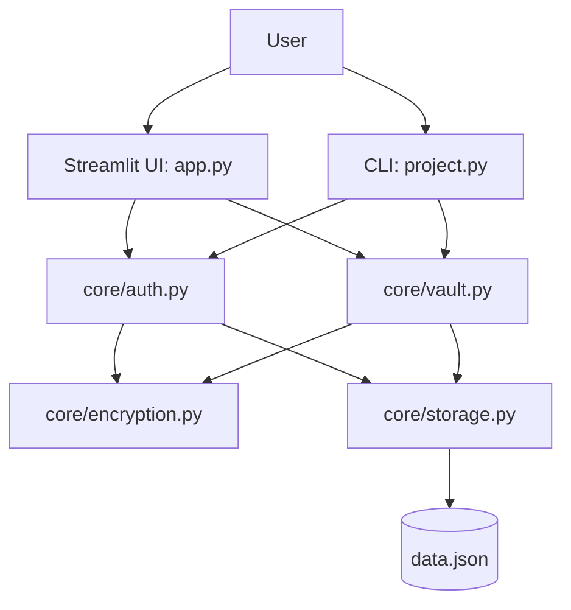

# 🔒 Secure Password Vault

A **production-ready, offline password manager** built with Python. Features both a modern **Streamlit web interface** and a **command-line interface**, with military-grade encryption and comprehensive security practices.

## 💼 Portfolio Highlights

- Designed with a **clean modular architecture** (`core/` business logic + thin UI layers)
- Implemented **defense-in-depth security** (bcrypt, PBKDF2, Fernet, lockout, timeout)
- Added **resilience protections** (atomic writes, file locking, corruption backup strategy)
- Covered behavior with a **comprehensive automated test suite** (70+ tests)
- Built for **offline-first privacy** with zero cloud/network dependency

---

## ✨ Features

| Feature | Description |
|---|---|
| **AES-256 Encryption** | All passwords encrypted with Fernet (AES-CBC + HMAC) |
| **PBKDF2 Key Derivation** | Per-user encryption keys derived from master password (1.2M iterations) |
| **Bcrypt Hashing** | Master passwords hashed with bcrypt (12 rounds) — immune to rainbow tables |
| **Password Strength Checker** | Enforces uppercase, lowercase, digits, special chars, and minimum length |
| **Password Generator** | Cryptographically secure random password generation (12–128 chars) |
| **Brute-Force Protection** | Account lockout after 5 failed login attempts (15-minute cooldown) |
| **Session Timeout** | Automatic logout after 30 minutes of inactivity |
| **Atomic File Writes** | Data saved via temp-file + rename to prevent corruption |
| **File Locking** | Concurrent access protection with file locks |
| **Audit Logging** | All security events logged to `vault.log` |
| **Search & Filter** | Search through stored credentials in the web UI |
| **Account Deletion** | Full account and credential removal with confirmation |
| **Credential CRUD** | Add, view, update, and delete site credentials |

## 🏗️ Architecture

The project follows a **modular architecture** with a shared `core/` package containing all business logic, and thin UI layers for each interface:

```
├── core/                   # Shared business logic (zero UI dependencies)
│   ├── __init__.py         # Package initializer
│   ├── config.py           # All configuration constants
│   ├── encryption.py       # PBKDF2 key derivation, Fernet encrypt/decrypt
│   ├── password_utils.py   # Password strength, generation, input validation
│   ├── storage.py          # JSON persistence, file locking, atomic writes
│   ├── auth.py             # User registration, login, bcrypt hashing
│   └── vault.py            # Credential CRUD, master password change, account deletion
├── app.py                  # Streamlit web UI (thin layer → imports core/)
├── project.py              # CLI interface (thin layer → imports core/)
├── gui.py                  # Tkinter desktop GUI (legacy)
├── test_project.py         # Comprehensive pytest test suite
├── data.json               # Encrypted user data (auto-created)
├── master.hash             # Master password bcrypt hash (CLI, auto-created)
├── requirements.txt        # Python dependencies
├── .gitignore              # Excludes sensitive files from version control
└── README.md               # This file
```

### Data & Control Flow



### Module Responsibilities

| Module | Purpose |
|---|---|
| `core/config.py` | File paths, iteration counts, password rules, timeouts |
| `core/encryption.py` | `derive_key()`, `encrypt_value()`, `decrypt_value()` |
| `core/password_utils.py` | `check_password_strength()`, `generate_password()`, `validate_username()` |
| `core/storage.py` | `load_data()`, `save_data()`, `load_master_hash()`, `store_master_hash()` |
| `core/auth.py` | `hash_password()`, `verify_password()`, `register_user()`, `authenticate_user()` |
| `core/vault.py` | `add_credential()`, `get_credential()`, `delete_credential()`, `change_master_password()` |

## 🔐 Security Model

### Encryption Flow
1. User registers with a master password
2. A random 16-byte salt is generated per user
3. PBKDF2-HMAC-SHA256 derives a 256-bit encryption key from the password + salt
4. Site passwords are encrypted with Fernet (AES-CBC + HMAC-SHA256)
5. Only the encrypted ciphertexts are stored — **your master password is never saved**

### Password Storage
- Master password → **bcrypt hash** (12 rounds, per-user salt)
- Site passwords → **Fernet encryption** (AES-256, per-user PBKDF2 key)
- All data stored **locally** — no cloud, no network calls

### Threat Mitigations
- ✅ Brute-force: Account lockout + bcrypt slow hashing
- ✅ Rainbow tables: Per-user random salts
- ✅ Data at rest: AES-256 encryption
- ✅ File corruption: Atomic writes + file locking
- ✅ Data recovery safety: Corrupt-file backup before reset
- ✅ Session hijacking: Auto timeout + explicit logout
- ✅ Weak passwords: Enforced strength requirements

## 🚀 Quick Start

### Prerequisites
- Python 3.9+

### Installation

```bash
# Clone the repository
git clone https://github.com/YOUR_USERNAME/GITHUB-PROJECT-PM.git
cd GITHUB-PROJECT-PM

# Create virtual environment
python -m venv venv

# Activate (Windows)
venv\Scripts\activate

# Activate (macOS/Linux)
source venv/bin/activate

# Install dependencies
pip install -r requirements.txt
```

### Run the Web App (Streamlit)

```bash
streamlit run app.py
```

Then open http://localhost:8501 in your browser.

### Run the CLI

```bash
python project.py
```

### Run Tests

```bash
pytest test_project.py -v
```

## 📸 Usage

### Web Interface (Streamlit)
1. **Register** — Create an account with a strong master password
2. **Login** — Authenticate with your credentials
3. **Add Credential** — Save site usernames and passwords (optionally auto-generate)
4. **View Credentials** — Search and view your saved passwords (hidden by default)
5. **Generate Password** — Create strong random passwords on demand
6. **Delete Credential** — Remove saved credentials with confirmation
7. **Reset Master Password** — Change your master password (re-encrypts all data)
8. **Delete Account** — Permanently remove your account and all data

### CLI Interface
1. **Create master password** — First-time setup with strength validation
2. **Create account** — Register a user with bcrypt-hashed password
3. **Login** — Authenticate and access the password vault
4. **Save/Retrieve/Update/Delete** — Full CRUD for site passwords
5. **Generate password** — Random secure password generation

## 🧪 Testing

The test suite covers 50+ test cases organized by module:

- **core.password_utils** — Strength validation, generation, username validation, input sanitization
- **core.encryption** — Key derivation consistency, encrypt/decrypt roundtrip, wrong-key rejection
- **core.storage** — Save/load JSON, corruption handling, master hash persistence
- **core.auth** — Registration, authentication, duplicate detection, weak passwords
- **core.vault** — Credential CRUD, master password change with re-encryption, account deletion
- **project.py CLI** — Master password creation, account creation, site password wrappers

```bash
# Run with verbose output
pytest test_project.py -v

# Run with coverage
pytest test_project.py --cov=core --cov=project -v
```

## 📁 Data Files

| File | Purpose | Committed |
|---|---|---|
| `data.json` | Unified user data (both web & CLI) | ❌ (in .gitignore) |
| `master.hash` | Master password bcrypt hash (CLI) | ❌ |
| `vault.log` | Security audit log | ❌ |

> ⚠️ **Never commit sensitive data files to version control.** The `.gitignore` is configured to exclude them.

## 🛠️ Tech Stack

- **Python 3.9+**
- **Streamlit** — Web UI framework
- **cryptography** — Fernet (AES-256) encryption + PBKDF2
- **bcrypt** — Password hashing
- **filelock** — Cross-platform file locking
- **pytest** — Testing framework

## 📝 License

MIT License — see [LICENSE](LICENSE) for details.

## 🙏 Acknowledgments

- [CS50P](https://cs50.harvard.edu/python/) — Foundation and inspiration
- [cryptography library docs](https://cryptography.io/) — Encryption best practices
- [OWASP Password Storage Cheat Sheet](https://cheatsheetseries.owasp.org/cheatsheets/Password_Storage_Cheat_Sheet.html) — Security guidance

---

**VIDEO DEMO**: [https://youtu.be/hDBWixbLe4U](https://youtu.be/hDBWixbLe4U)
